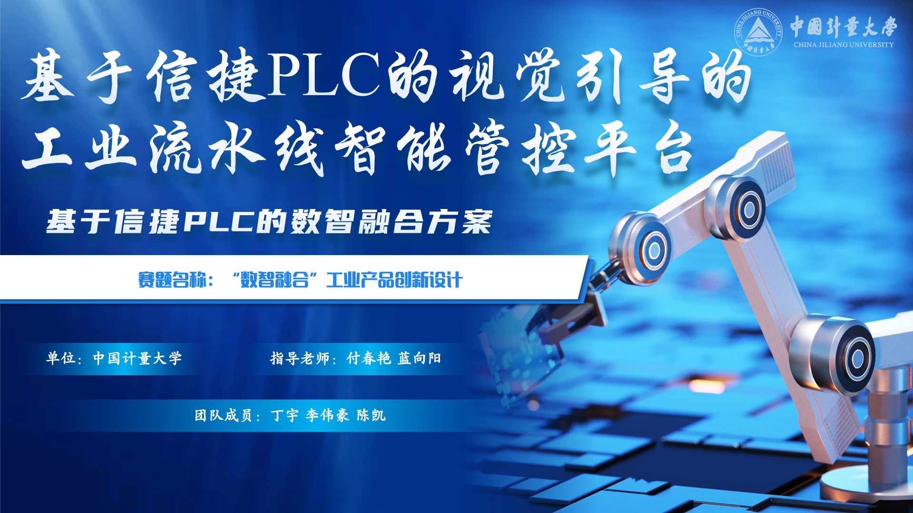

# Vision-Guided Industrial Control Platform

An industrial automation showcase project that combines two functional modules:

- `industrial-control-platform`: the main conveyor, robot-arm, tracking, and coordination platform
- `ocr_project`: a standalone OCR and energy-label recognition microservice used by the wider system

This repository is organized as a portfolio-ready project for CV and technical review. In addition to the runnable codebase, it includes demo media, exported presentation slides, Arduino firmware, an OCR microservice, and reference documents that show the hardware setup and system outcomes.

## Demo And Showcase Assets

- Full demo video: [docs/media/demo_video.mp4](docs/media/demo_video.mp4)
- Embedded presentation clip: [docs/media/presentation_clip.mp4](docs/media/presentation_clip.mp4)
- Competition paper PDF: [docs/reference/competition-paper.pdf](docs/reference/competition-paper.pdf)
- Competition paper DOCX: [docs/reference/competition-paper.docx](docs/reference/competition-paper.docx)
- Conveyor firmware: [industrial-control-platform-2/hardware/arduino/belt/belt.ino](industrial-control-platform-2/hardware/arduino/belt/belt.ino)
- Robot-arm firmware: [industrial-control-platform-2/hardware/arduino/robot_arm/robotarm0724.ino](industrial-control-platform-2/hardware/arduino/robot_arm/robotarm0724.ino)

## Project Snapshot

- Real-time visual tracking with YOLO and DeepSORT for object localization and motion continuity.
- Conveyor and robot-arm coordination through backend APIs and hardware control modules.
- PLC-centered system orchestration with Arduino-based device control for selected hardware components.
- A dedicated OCR microservice for OCR and energy-label recognition scenarios.
- Portfolio assets bundled into the repository, including diagrams, presentation slides, firmware, and demo videos.

## System Modules

### 1. Industrial Control Platform

This is the main full-stack application in the repository. It provides the Vue dashboard, Flask backend, hardware integration endpoints, WebSocket updates, and workflow orchestration for conveyor control and robot-arm coordination.

### 2. OCR Microservice

The `ocr_project/` directory contains a standalone FastAPI service for OCR and energy-label recognition. It is designed as a separate functional component so that the control platform can call OCR capabilities over HTTP instead of embedding all OCR runtime logic directly into the main backend.

## Visual Preview

### Project Cover



### Cross-Domain System Integration


### End-To-End Workflow


### Hardware And Results


### PLC And Hardware Selection


### Overall Architecture


## Technical Scope

### Software

- Frontend: Vue 3, TypeScript, Vite, Element Plus, Pinia, ECharts, Three.js
- Backend: Flask, Flask-SocketIO, Flask-CORS, PySerial
- OCR Service: FastAPI, Jinja2, PaddleOCR-json integration, Ultralytics YOLO
- Vision: OpenCV, Ultralytics YOLO, DeepSORT, NumPy, Pillow
- Messaging: Socket.IO and MQTT

### Hardware

- XINJE PLC-based conveyor control workflow
- Arduino firmware for conveyor and robot-arm control
- Serial communication for robotic actuators and industrial peripherals
- Camera-based inspection and tracking pipeline

## Repository Structure

```text
vision-guided-industrial-control/
  industrial-control-platform-2/
    backend/                   Flask APIs, device services, tracking services
    frontend/src/              Vue application source
    backend/model/             Demo model and dataset template
    hardware/arduino/          Arduino firmware used by the platform
  ocr_project/                 Standalone OCR and energy-label microservice
  docs/media/                  Demo videos and exported presentation slides
  docs/reference/              Competition paper and supporting material
  README.md                    Portfolio overview for both modules
```

## Quick Start

1. Install Python dependencies.

```bash
cd industrial-control-platform-2
pip install -r requirements.txt
```

2. Install frontend dependencies.

```bash
npm install
```

3. Create the local environment file.

```bash
copy .env.example .env
```

4. Start the backend service.

```bash
python backend/app.py
```

5. Start the frontend.

```bash
npm run dev
```

6. Start the OCR microservice when OCR endpoints are needed.

```bash
cd ..\ocr_project
pip install -r requirements.txt
uvicorn main:app --host 127.0.0.1 --port 8000
```

The default local endpoints are:

- Frontend: `http://localhost:3000`
- Backend: `http://localhost:5000`
- OCR microservice: `http://localhost:8000`

## Build And Verification

Useful commands before publishing or demoing the project:

```bash
python -m compileall -q backend
npm run build
npm audit --audit-level=moderate
```

## Additional Notes

- Local secrets, databases, caches, `node_modules`, and production builds are intentionally ignored.
- The bundled YOLO model at `industrial-control-platform-2/backend/model/best.pt` is kept in the repository so the project can be reviewed and demoed more easily.
- The OCR microservice keeps its own YOLO model in `ocr_project/models/yolo_energy_label.pt`.
- The full `paddleocr_json` Windows runtime is intentionally not vendored in this repository because it contains large third-party binaries. The OCR module documents how to attach it locally.
- The original competition slide deck is not committed because the raw `.pptx` exceeds GitHub's single-file limit. Exported slide images and the competition paper are included instead.

## Intellectual Property Notice

This repository is published for portfolio and technical review purposes. The project includes technology related to pending patent applications. No patent license is granted by making this repository publicly available.

All rights are reserved unless a separate written license is provided.
