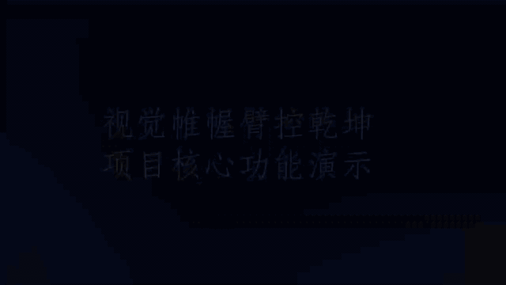
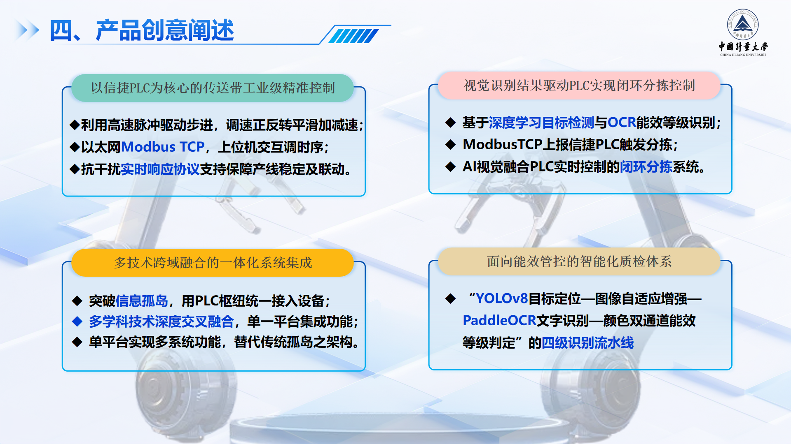
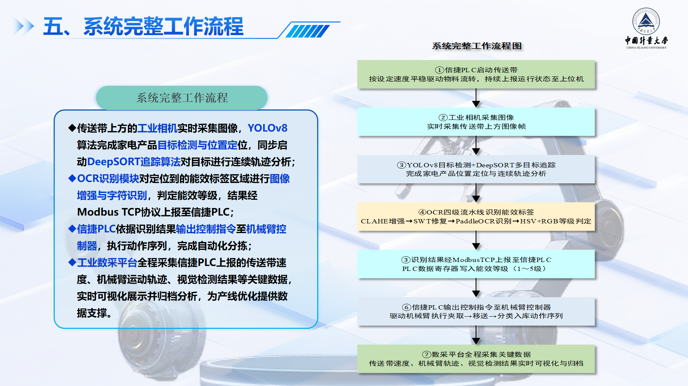
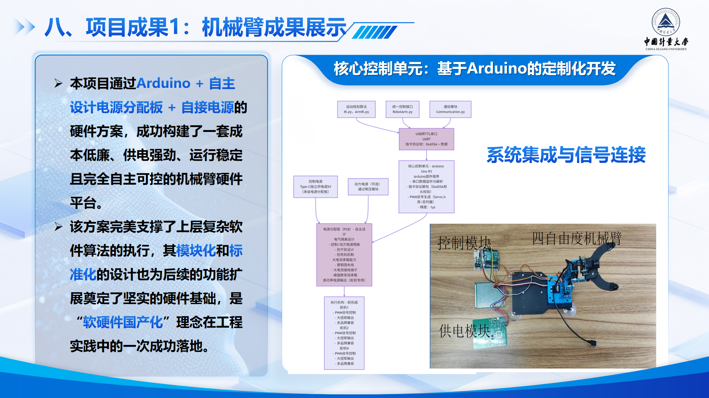
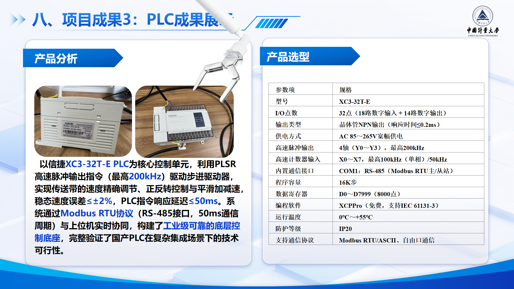
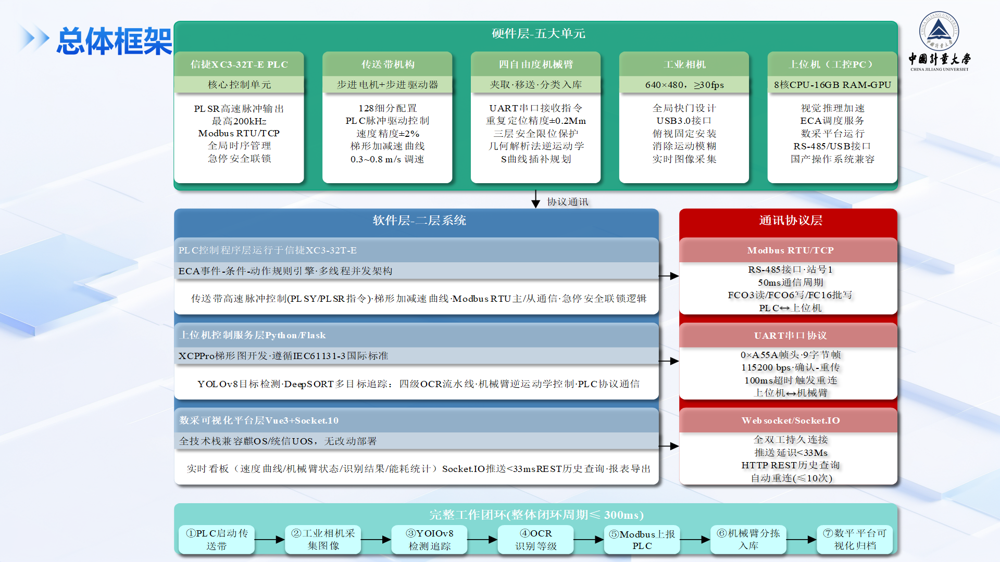

# Vision-Guided Industrial Control Platform

This repository documents an industrial water-line control platform built around PLC coordination, visual tracking, robot-arm control, conveyor control, MQTT messaging, and a standalone OCR service. It includes runnable source code, Arduino firmware, demo media, exported system diagrams, and reference material for reviewing the complete implementation.

## Demo Animations

The project demonstrations are provided as silent GIFs so they render directly inside the GitHub README.

### Full System Demo


Source MP4: [docs/media/demo_video.mp4](docs/media/demo_video.mp4)

### Tracking And Control Clip



Source MP4: [docs/media/presentation_clip.mp4](docs/media/presentation_clip.mp4)

## Repository Map

- [Industrial control platform](industrial-control-platform-2/README.md): Vue dashboard, Flask backend, conveyor workflow, robot-arm control, tracking services, MQTT integration, and Arduino firmware.
- [OCR microservice](ocr_project/README.md): standalone FastAPI service for OCR and energy-label recognition.
- [MQTT setup guide](industrial-control-platform-2/MQTT_INSTALLATION_GUIDE.md): broker setup, ports, topics, and connection checks.
- [Competition paper PDF](docs/reference/competition-paper.pdf) and [DOCX](docs/reference/competition-paper.docx): reference description of the design background and outcomes.

## System Overview

The system is organized as two connected but separately runnable modules:

- `industrial-control-platform-2/` is the main control platform. It provides the operator dashboard, backend APIs, device coordination, tracking pipeline, Socket.IO updates, MQTT publishing/subscription support, and Arduino firmware for selected hardware components.
- `ocr_project/` is an independent OCR and energy-label recognition service. The main backend can call it through HTTP endpoints, keeping OCR runtime dependencies separate from the control platform.

The implementation is designed to show the complete engineering chain: camera input, visual target detection, motion tracking, conveyor status feedback, robot-arm execution, OCR recognition, MQTT telemetry, and dashboard visualization.

## End-To-End Workflow

1. A camera captures the industrial line or target object.
2. The backend tracking service applies YOLO-based detection and DeepSORT-based tracking.
3. Tracking results are published to the dashboard through Socket.IO and can also be distributed through MQTT.
4. The conveyor and robot-arm workflows are controlled through backend APIs and hardware adapters.
5. OCR tasks are routed to the standalone OCR microservice when energy-label or text recognition is required.
6. The frontend dashboard displays control state, tracking results, device status, and integration feedback.

## Control Implementation Highlights

- Project-specific Arduino firmware is included for both the conveyor and the robot arm, rather than treating the hardware as a black-box simulator.
- The conveyor firmware receives serial speed and direction commands from the Flask backend, then converts physical belt speed in `m/s` into stepper pulse frequency using `STEPS_PER_REV` and `BELT_PER_REV`.
- The conveyor motor is driven through a `PUL/DIR` stepper interface with AccelStepper, which makes the backend speed command directly traceable to motor pulse output.
- The robot-arm firmware implements a custom binary serial protocol with the `0xA5 0x5A` frame header, servo count, movement time, servo ID, and pulse-width payload.
- The Arduino robot-arm controller drives servos with `writeMicroseconds()` and applies 20 ms incremental updates for smoother multi-servo motion.
- The Python backend maps joint angles into calibrated `500-2500 us` PWM pulse ranges and can send batched multi-servo commands over the same protocol.
- The inverse-kinematics layer converts target `(x, y, z)` position and pitch into servo angles and pulse commands using measured link lengths and reachable-range checks.
- The full control path is visible in the repository: dashboard command -> Flask API -> serial protocol or MQTT/Socket.IO event -> Arduino firmware -> stepper motor or servo output.

## Communication And MQTT

The platform uses multiple communication layers because different parts of the system have different timing and integration needs:

- REST APIs handle explicit control requests, status queries, OCR proxy calls, and device-management actions.
- Socket.IO provides realtime dashboard updates for interactive monitoring.
- MQTT supports decoupled telemetry and command topics for tracking, system status, control commands, video frames, OCR events, and alert messages.

The frontend MQTT topic definitions are in [frontend/src/api/mqttApi.ts](industrial-control-platform-2/frontend/src/api/mqttApi.ts). The backend MQTT service is in [backend/services/mqtt_service.py](industrial-control-platform-2/backend/services/mqtt_service.py). Local broker setup is documented in [MQTT_INSTALLATION_GUIDE.md](industrial-control-platform-2/MQTT_INSTALLATION_GUIDE.md).

## Technical Scope

### Software

- Frontend: Vue 3, TypeScript, Vite, Element Plus, Pinia, ECharts, Three.js
- Backend: Flask, Flask-SocketIO, Flask-CORS, PySerial
- Vision: OpenCV, Ultralytics YOLO, DeepSORT, NumPy, Pillow
- OCR service: FastAPI, Jinja2, PaddleOCR-json integration, Ultralytics YOLO
- Messaging: REST, Socket.IO, MQTT

### Hardware And Firmware

- XINJE PLC-centered conveyor-control workflow
- Arduino conveyor firmware with stepper pulse conversion: [hardware/arduino/belt/belt.ino](industrial-control-platform-2/hardware/arduino/belt/belt.ino)
- Arduino robot-arm firmware with a custom servo protocol: [hardware/arduino/robot_arm/robotarm0724.ino](industrial-control-platform-2/hardware/arduino/robot_arm/robotarm0724.ino)
- Python serial protocol bridge and inverse-kinematics driver: [backend/api/robot_arm.py](industrial-control-platform-2/backend/api/robot_arm.py)
- Serial communication for robotic actuators, conveyor hardware, and industrial peripherals
- Camera-based inspection and tracking pipeline

## System Diagrams And Evidence

### Cross-Domain System Integration



### End-To-End Workflow



### Hardware And Results



### PLC And Hardware Selection



### Overall Architecture



## Repository Structure

```text
vision-guided-industrial-control/
  industrial-control-platform-2/
    backend/                   Flask APIs, device services, tracking services
    frontend/src/              Vue application source
    backend/model/             Demo model and dataset template
    hardware/arduino/          Arduino firmware used by the platform
    MQTT_INSTALLATION_GUIDE.md MQTT broker setup and validation guide
    README.md                  Main platform module documentation
  ocr_project/                 Standalone OCR and energy-label microservice
  docs/media/                  Demo videos, GIF renderings, and exported presentation slides
  docs/reference/              Competition paper and supporting material
  README.md                    Overall project documentation
```

## Quick Start

1. Start an MQTT broker when MQTT communication is needed. See [MQTT setup guide](industrial-control-platform-2/MQTT_INSTALLATION_GUIDE.md).

2. Install and run the main platform.

```bash
cd industrial-control-platform-2
pip install -r requirements.txt
npm install
copy .env.example .env
python backend/app.py
npm run dev
```

3. Start the OCR service when OCR endpoints are needed.

```bash
cd ..\ocr_project
pip install -r requirements.txt
uvicorn main:app --host 127.0.0.1 --port 8000
```

Default local endpoints:

- Frontend: `http://localhost:3000`
- Backend: `http://localhost:5000`
- OCR microservice: `http://localhost:8000`
- MQTT broker: `localhost:1883`

## Build And Verification

Useful commands before demonstrating or publishing changes:

```bash
cd industrial-control-platform-2
python -m compileall -q backend
npm run build
```

```bash
cd ..\ocr_project
python -m compileall -q .
```

## Notes

- Local secrets, databases, caches, `node_modules`, and production builds are intentionally ignored.
- The bundled YOLO model at `industrial-control-platform-2/backend/model/best.pt` is kept so the tracking workflow can be reviewed and demonstrated more easily.
- The OCR microservice keeps its own YOLO model in `ocr_project/models/yolo_energy_label.pt`.
- The full `paddleocr_json` Windows runtime is intentionally not vendored because it contains large third-party binaries. The OCR module documents how to attach it locally.
- The original competition slide deck is not committed because the raw `.pptx` exceeds GitHub's single-file limit. Exported slide images and reference documents are included instead.

## Intellectual Property Notice

This repository is published for technical review and project demonstration. The project includes technology related to pending patent applications. No patent license is granted by making this repository publicly available.

All rights are reserved unless a separate written license is provided.
